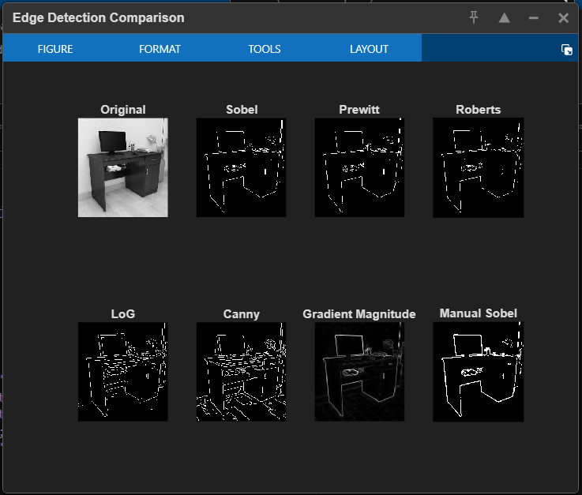

# Image Edge Detection using MATLAB

This repository contains a MATLAB-based project that extracts and visualizes object boundaries in digital images using multiple image edge detection techniques such as Sobel, Prewitt, and Canny.

The aim of this project is to help students and beginners understand how edge detection works in digital image processing and how it is applied in real-world computer vision systems.

---

## 📌 Features

- Detects object boundaries in images  
- Supports Sobel, Prewitt, and Canny methods  
- Works with both grayscale and RGB images  
- Highlights important structural details like shapes and contours  
- Simple and easy MATLAB implementation  
- Suitable for academic mini projects and demonstrations  

---

## 🖼 Output Results

Below are sample outputs generated by the project:

### ▶ Output 1  
Grayscale image with detected object boundaries:  

### ▶ Output 2  
Final processed image showing clear boundary features:  

---

## ⚙ How to Run the Project

1. Download or clone the repository.  

2. Open MATLAB and set your current folder to the project directory.

3. Make sure the following files are present:

## 💻 Requirements

- MATLAB (R2018a or later recommended)  
- Image Processing Toolbox  

---

## 💻 Applications

- Object boundary detection  
- Surface and shape recognition  
- Medical image preprocessing  
- Document and text boundary identification  
- Feature extraction for computer vision systems  
- Pattern recognition and robotics vision  

---

## ⚠ Limitations

- Sensitive to noisy and low-quality images  
- Performance depends on image contrast and resolution  
- Highly detailed or textured images may produce extra boundaries  
- Needs parameter tuning for best results on different images  

---

## 🚀 Future Improvements

- Implementation of adaptive threshold techniques  
- Support for video-based boundary detection  
- Multi-scale boundary extraction  
- Integration with machine learning-based feature extraction  
- Automatic noise reduction preprocessing  
